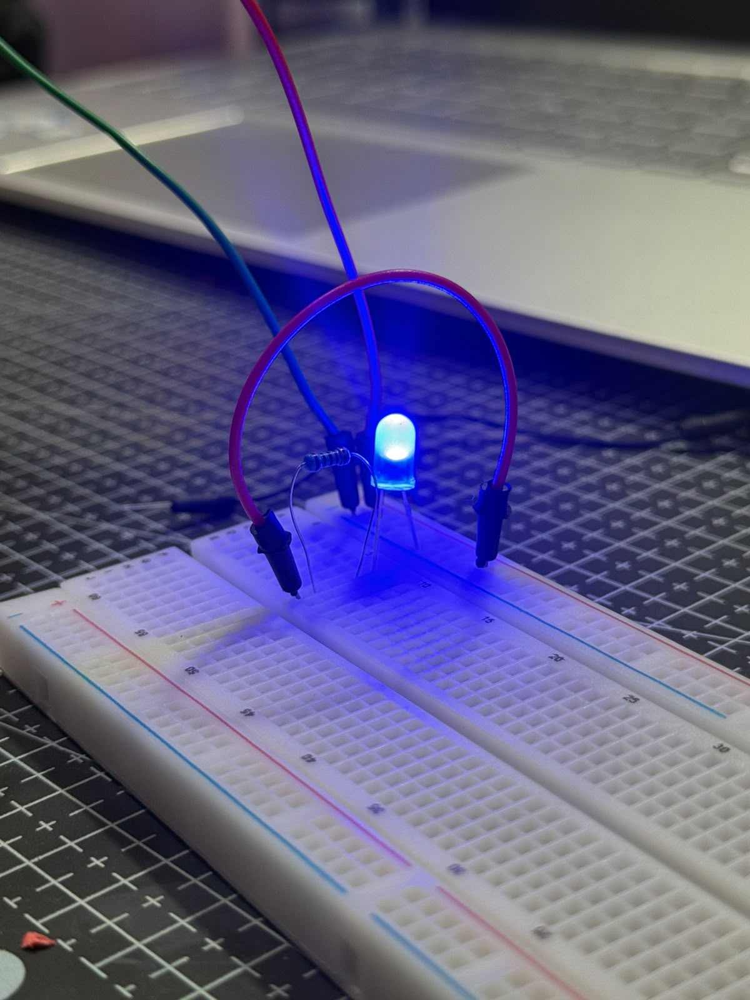
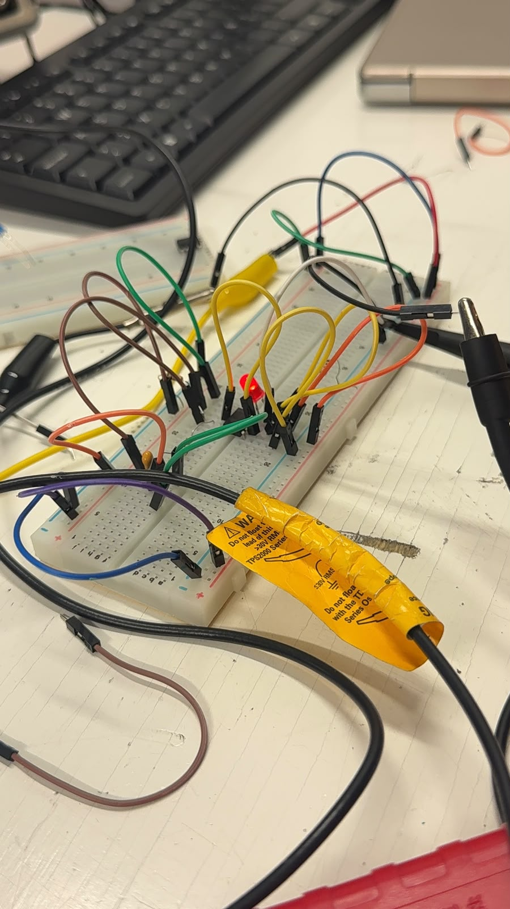
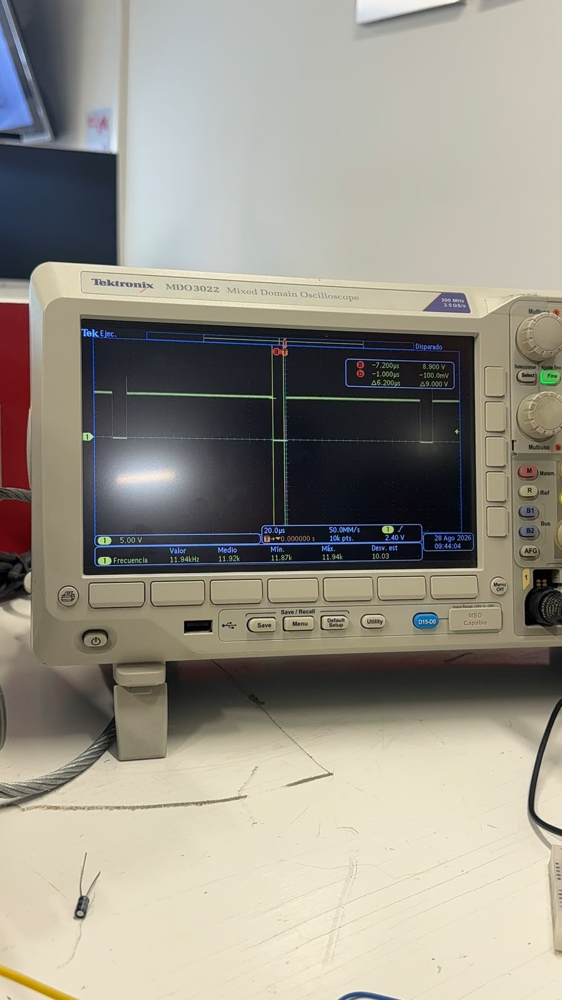

# Sesión 2 — Componentes básicos 
## Qué debía lograr hoy
- [x] Lograr que un LED encienda de forma básica
- [x] Conseguir que ese LED parpadeara sin usar código

## Qué usé
- CI Temporizador 555
- Capacitor electrolítico de 33 μF
- Capacitor electrolítico de 10 μF
- Capacitor cerámico de 10 nF
- Resistencia 1KΩ
- Resistencia 15KΩ
- Resistencia 220 Ω
- Led azul 
- Cables de puente 
- Protoboard 
- Osciloscopio 
- Sondas de osciloscopio

## Qué hice y qué pasó (evidencia)

*Vista del LED encendido en la protoboard, alimentado a través de una resistencia.*

*Segundo montaje del circuito, ahora con el LED parpadeando y monitoreado con la punta del osciloscopio.*

*Vista cercana del CI 555 con el capacitor cerámico sustituyendo al electrolítico en el circuito.*

*Señal capturada con el capacitor cerámico, mostrando una frecuencia mucho más alta que hace parecer el parpadeo del LED como una luz fija.*

## Qué falló y cómo lo resolví

- **Síntoma:** Al conectar el capacitor electrolítico, este comenzó a expulsar humo.
- **Cómo lo encontré:** Se notó de inmediato al energizar el circuito, ya que el humo salió apenas se hizo la conexión.
- **Solución:** Se desconectó el capacitor de inmediato y se revisó la polaridad antes de sustituirlo por uno nuevo, conectándolo correctamente esta vez.

## Qué aprendí
Antes no sabía qué pasaba realmente cuando un componente electrónico "se quema", pero lo viví de primera mano al conectar mal el capacitor electrolítico y ver cómo empezaba a salir humo. Eso me hizo entender que estos capacitores sí tienen polaridad y que conectarlos al revés puede dañarlos de inmediato, a diferencia de los capacitores cerámicos, que no la tienen. También aprendí a diferenciarlos a simple vista: el electrolítico es cilíndrico y con polaridad marcada, mientras que el cerámico es pequeño y sin esa restricción.

## Siguiente paso

Revisar siempre la polaridad de los capacitores electrolíticos antes de energizar el circuito.
