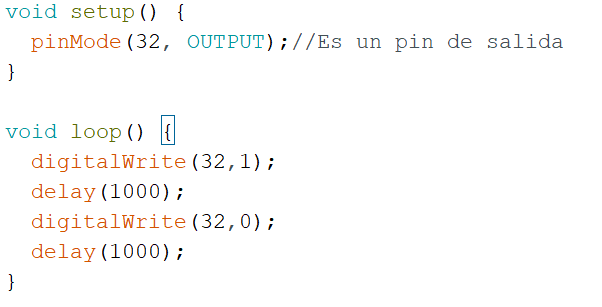
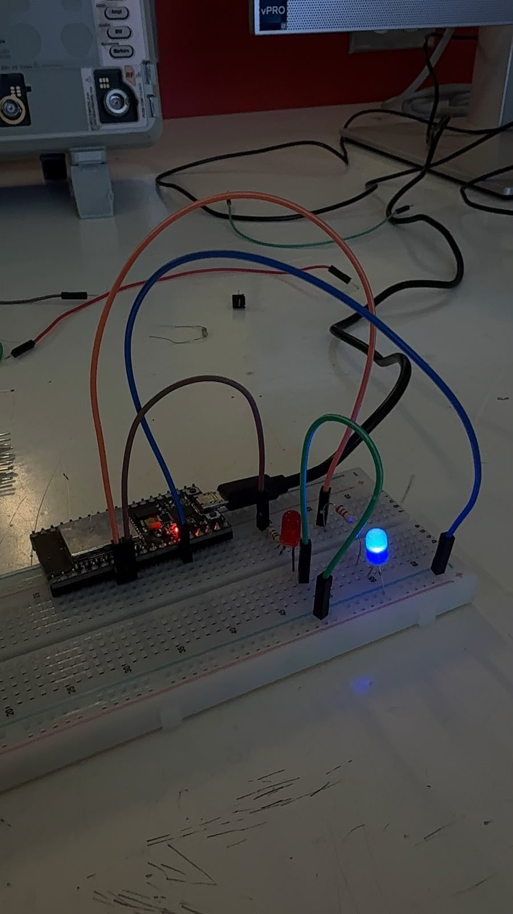
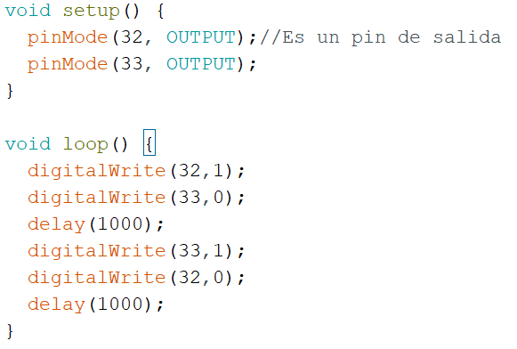
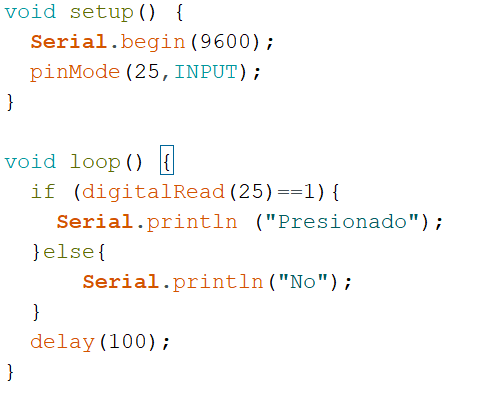
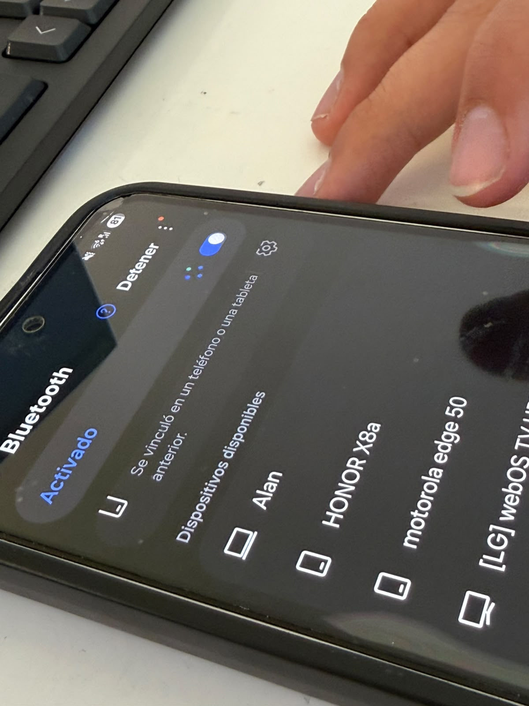
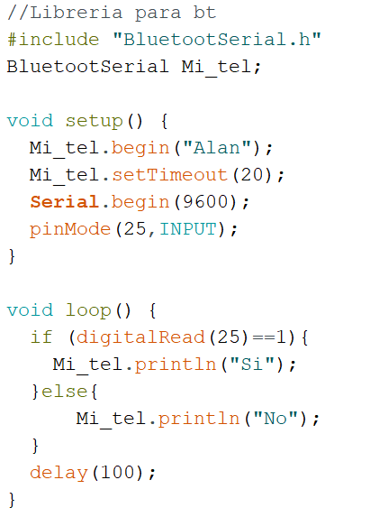
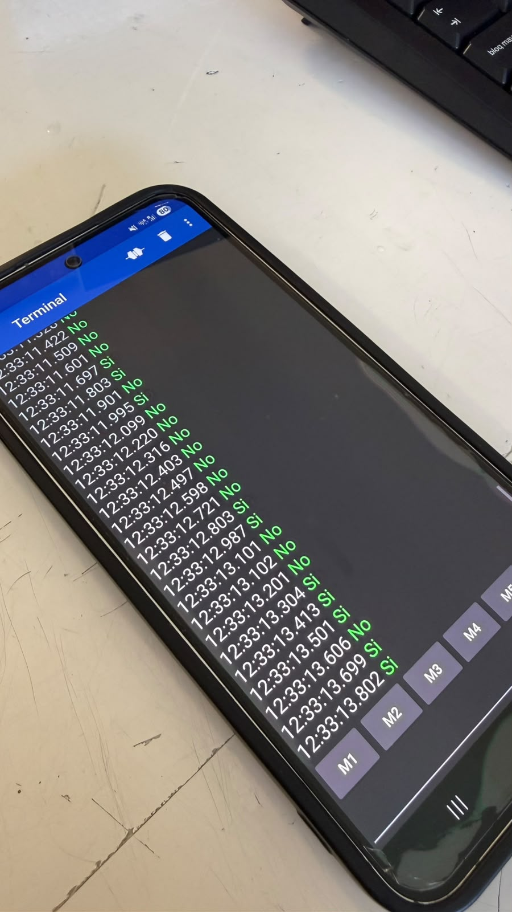
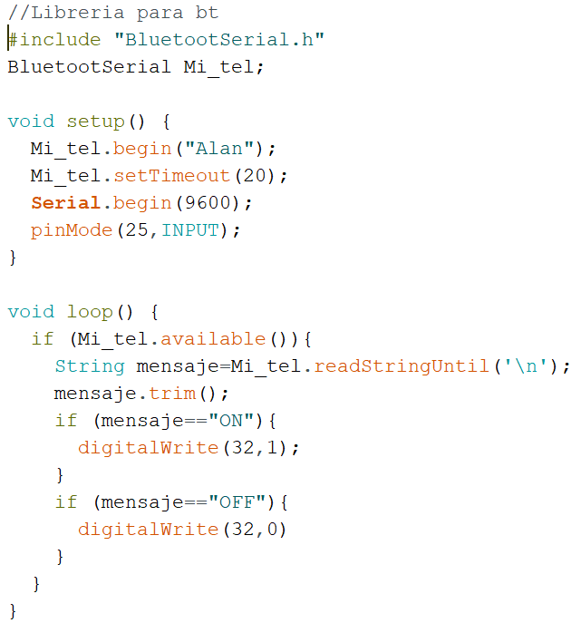
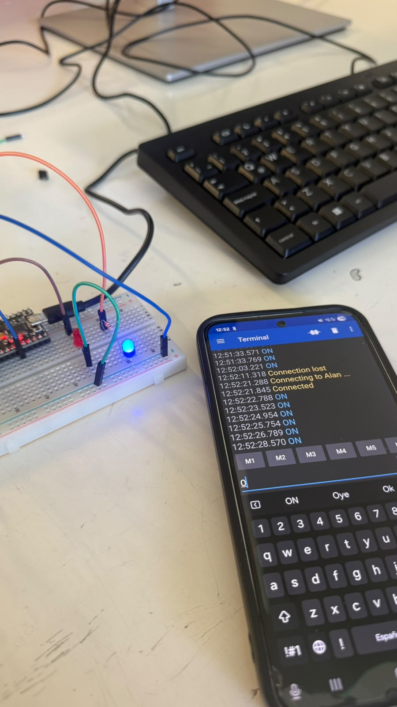
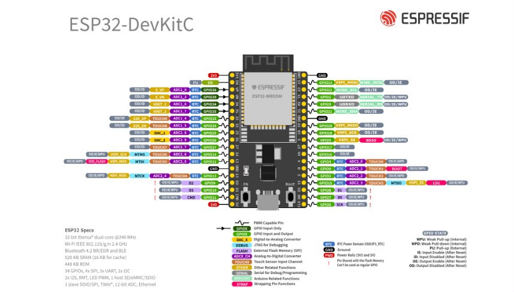

# Sesión 3 — ESP32: control por botón y bluetooth

## Qué debía lograr hoy
- [✅] Encender un LED con el ESP32
- [✅] Hacer que un LED parpadee con el ESP32
- [✅] Imprimir mensajes por el monitor serial desde el ESP32
- [✅] Detectar si un botón está presionado y enviar el estado por serial
- [✅] Conectar el ESP32 al teléfono por Bluetooth
- [✅] Enviar el estado del botón ("Sí"/"No") al teléfono vía Bluetooth
- [✅] Recibir comandos ("ON"/"OFF") desde el teléfono para encender o apagar el LED

## Qué usé
- ESP32
- Protoboard
- 2 LEDs azules
- 2 resistencias de 220 Ω
- Botón pulsador
- Cables de puente
- Cable USB

## Qué hice y qué pasó (evidencia)

*ESP32 alimentando un LED azul a través de una resistencia en la protoboard.*

*Primer programa en Arduino IDE que hace parpadear un LED de manera repetitiva en el ESP32, encendiéndolo y apagándolo con un intervalo de tiempo establecido.*

*LED azul parpadeando, controlado mediante el ESP32 mientras el LED rojo permanece apagado en la protoboard.*

*Código en Arduino que alterna el estado de dos pines cada segundo para lograr el efecto de parpadeo del LED.*

*Código en Arduino que lee el estado de un pin digital y envía "Presionado" o "No" por el monitor serial según se accione el botón.*

*Celular buscando el ESP32 entre los dispositivos Bluetooth disponibles para vincularse y recibir la señal del botón.*

*Código en Arduino que configura el ESP32 como dispositivo Bluetooth ("Alan") y envía "Sí" o "No" al celular según el estado del botón.*

*Terminal Bluetooth en el celular mostrando en tiempo real los mensajes "Sí"/"No" enviados por el ESP32 según el estado del botón.*

*Código en Arduino que recibe los comandos "ON" y "OFF" desde el celular por Bluetooth para controlar el estado del LED.*

*LED encendido en la protoboard tras enviar el comando "ON" desde la terminal Bluetooth del celular al ESP32.*

## Qué falló y cómo lo resolví

*Diagrama de pines del ESP32-DevKitC consultado para identificar correctamente las entradas y salidas usadas en el circuito.*

- **Síntoma:** Al intentar enlazar el ESP32 por Bluetooth, la señal no llegaba al celular y no se lograba establecer la conexión.
- **Cómo lo encontré:** Se intentó vincular varias veces desde la app del celular, notando que el ESP32 no aparecía o no respondía a la solicitud de emparejamiento.
- **Solución:** Se reinició el ESP32 y se volvió a subir el código, verificando que el nombre del dispositivo Bluetooth coincidiera con el que buscaba el celular, logrando así establecer la conexión correctamente.

## Qué aprendí  
Antes no sabía qué tan accesible podía ser programar y controlar un ESP32, pero aprendí que manejarlo es bastante sencillo y hasta divertido una vez que entiendes la lógica básica. También comprendí que el Bluetooth se puede aprovechar para muchas cosas más allá de solo prender un LED, ya que basta con enviar mensajes de texto simples para controlar el circuito. Y entendí cómo se mueve la señal entre el celular y el ESP32: los datos viajan como cadenas de texto que el microcontrolador interpreta y compara para decidir qué acción ejecutar.

## Siguiente paso
Explorar cómo controlar más de un componente a la vez usando Bluetooth desde el celular.
