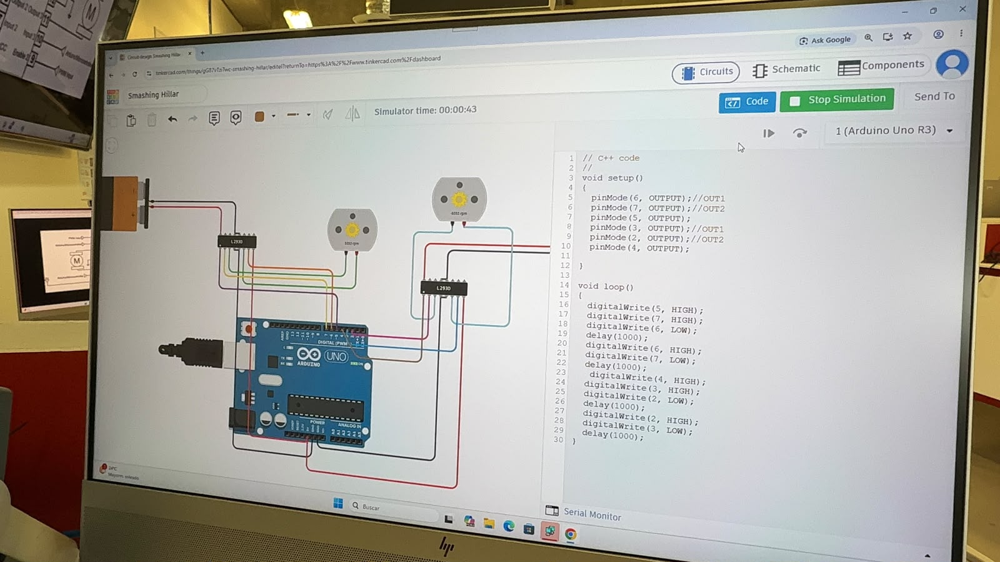
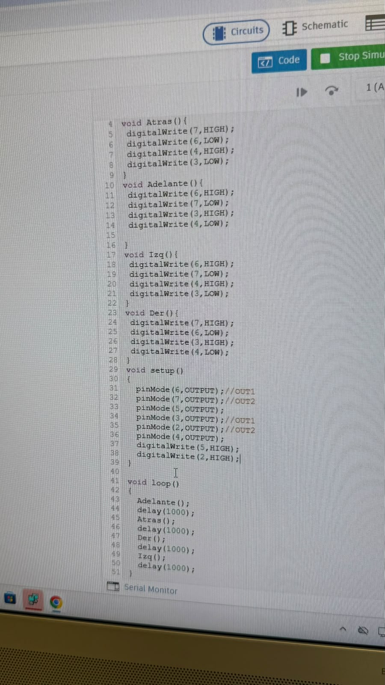
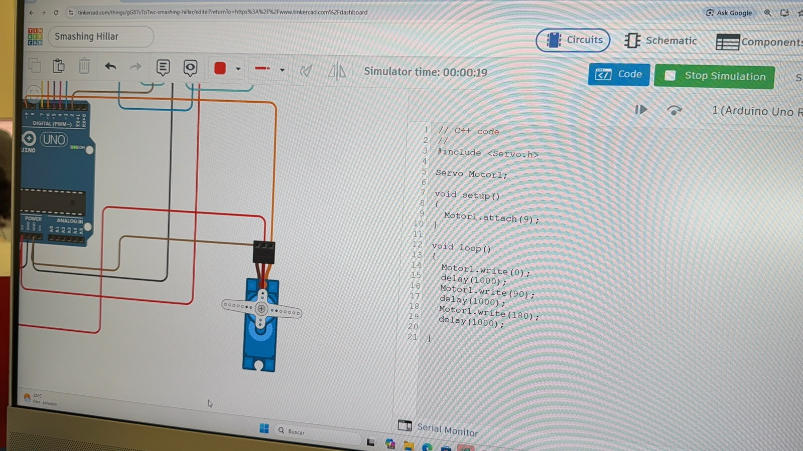

# Sesión 4 — Puentes H, motores DC y servos

## Qué debía lograr hoy
## Qué debía lograr hoy
- [✅] Simular el control de un motor DC con un puente H (L293D)
- [✅] Simular el control de dos motores DC, cada uno con su propio puente H
- [✅] Controlar el sentido de giro de un motor DC (adelante, atrás, izquierda, derecha)
- [✅] Encender y controlar un servomotor con Arduino

## Qué usé
- Arduino UNO (simulado en Tinkercad)
- Módulo puente H L293D (simulado en Tinkercad)
- 2 motores DC (simulados en Tinkercad)
- 1 servomotor (simulado en Tinkercad)
- Batería de 9V (simulada en Tinkercad)
- Cables de conexión (simulados en Tinkercad)

## Qué hice y qué pasó (evidencia)

*Simulación en Tinkercad de un Arduino UNO controlando un motor DC mediante el módulo puente H L293D.*

*Simulación en Tinkercad con dos motores DC, cada uno controlado por su propio módulo puente H L293D, invirtiendo el sentido de giro mediante el código.*

*Código en Tinkercad con las funciones Adelante, Atrás, Izq y Der, que combinan señales HIGH/LOW en el puente H para controlar la dirección del motor.*

*Simulación en Tinkercad del servomotor moviéndose entre las posiciones 0°, 90° y 180° mediante código en Arduino.*

## Qué falló y cómo lo resolví

- **Síntoma:** Al no entender bien el funcionamiento del puente H, se usaron dos módulos por error para controlar los motores, lo que generó un corto circuito en la simulación.
- **Cómo lo encontré:** Se notó al ejecutar la simulación, cuando el circuito marcó un corto en lugar de funcionar correctamente.
- **Solución:** Se identificó que un solo módulo puente H era suficiente para controlar ambos motores, se corrigieron las conexiones y se eliminó el módulo redundante.

## Qué aprendí
Antes no entendía bien cómo funcionaban los motores DC ni los servomotores, pero ahora comprendo que cada uno sirve para cosas distintas: el motor DC gira de forma continua y el servo se posiciona en un ángulo específico. También entendí el principio básico detrás de las llantas de un carro: usando un puente H se puede controlar la polaridad del motor para hacerlo girar hacia adelante o hacia atrás, que es justamente lo que necesitaría un vehículo para avanzar o retroceder.

## Siguiente paso
Aplicar lo aprendido para armar un pequeño carro controlado con motores DC y puente H.

