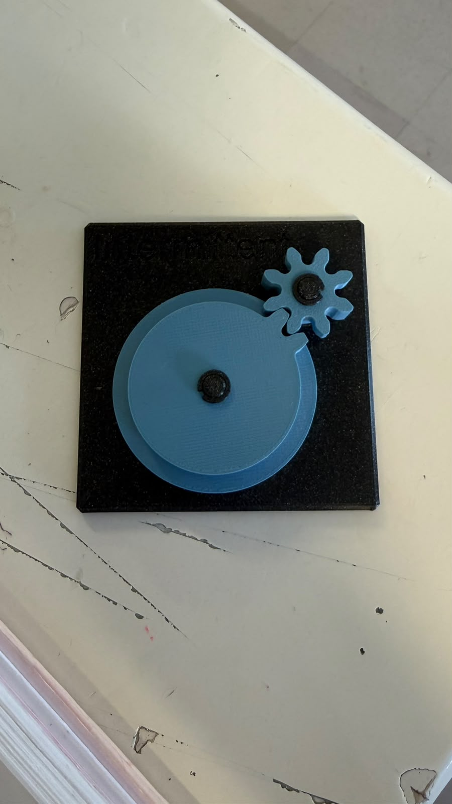
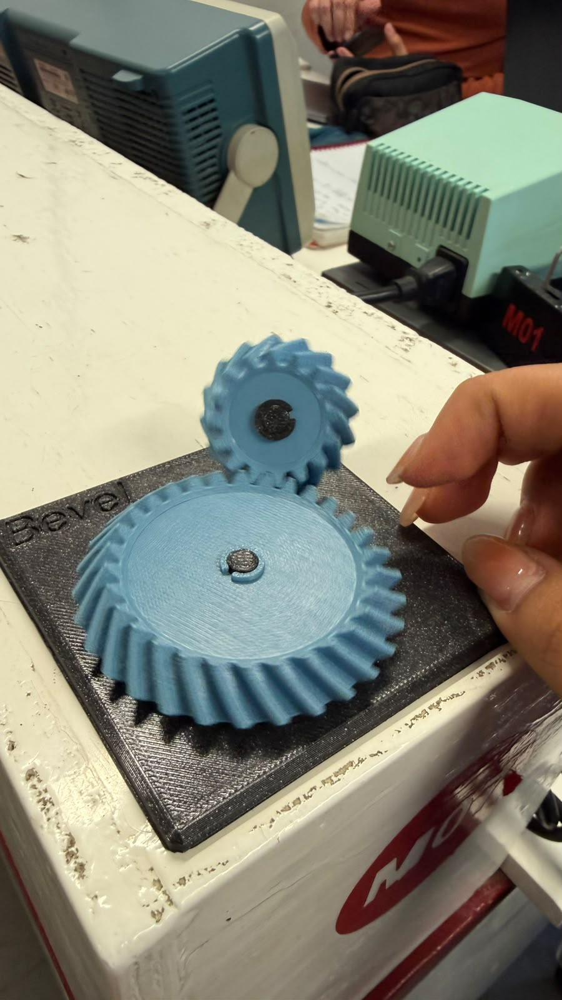
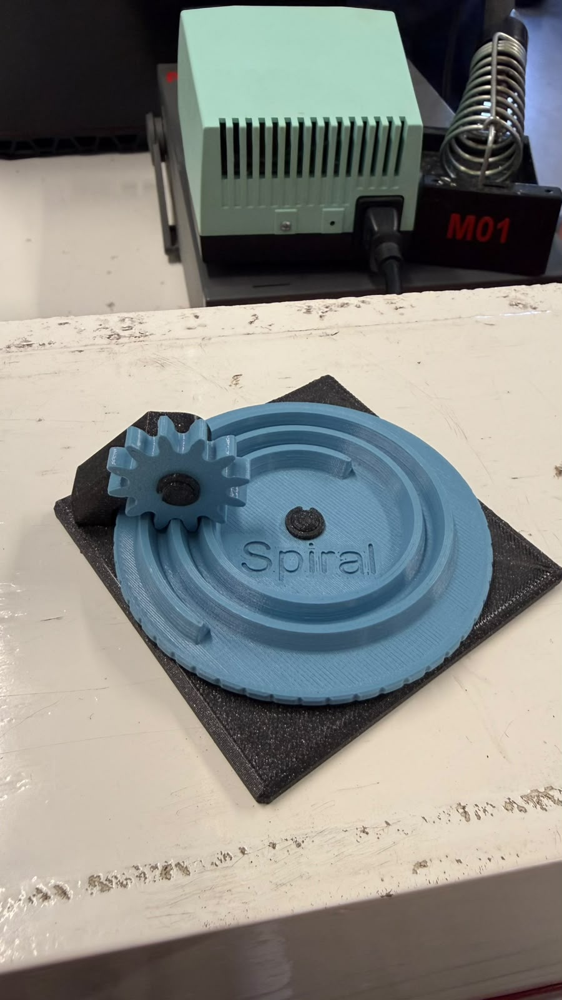
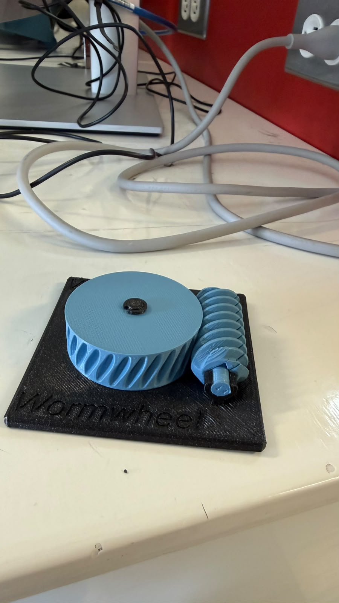
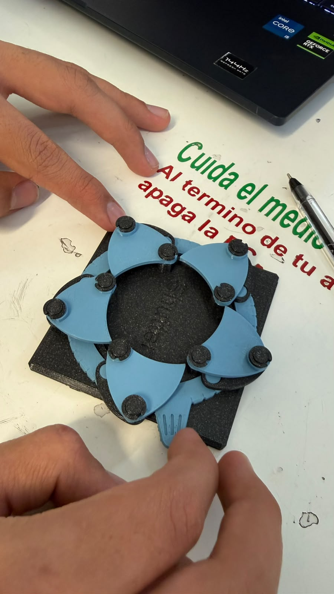
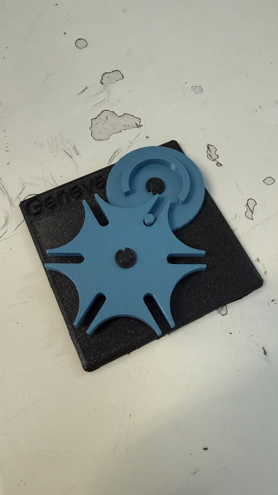
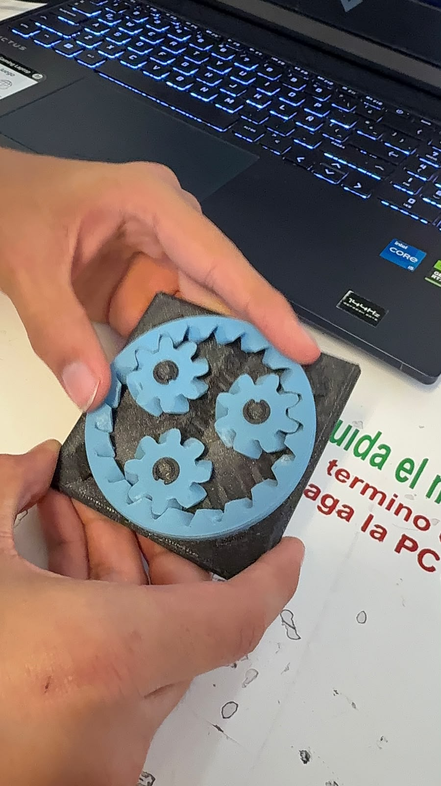
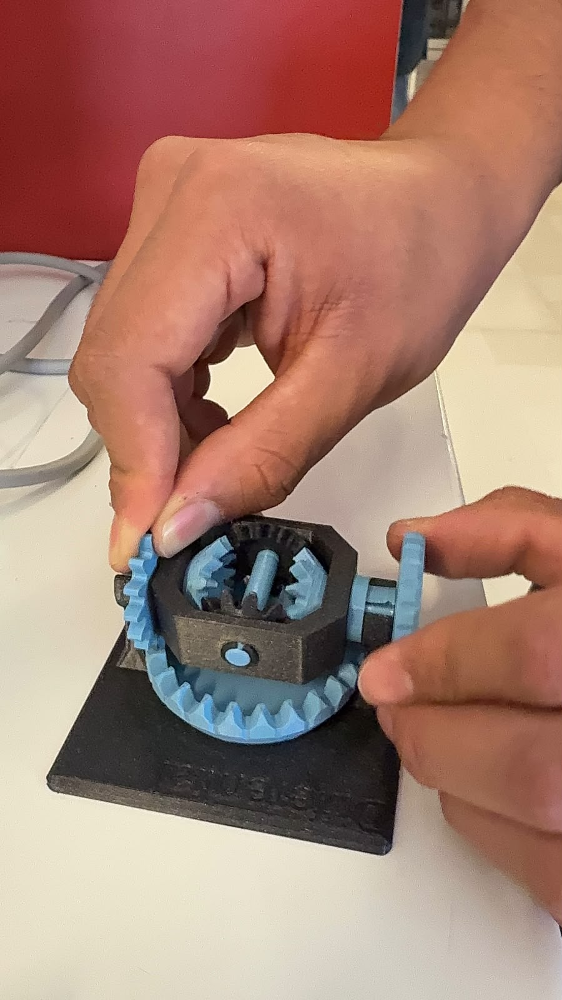
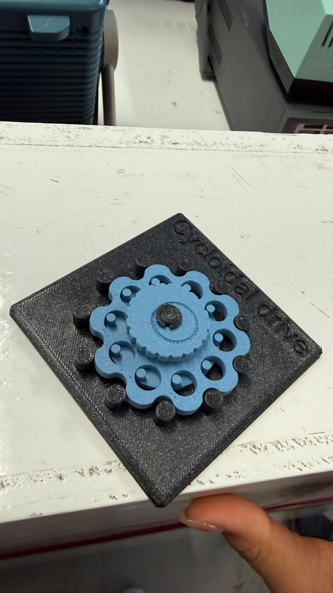

# Sesión 5 — Mecanismo 

## Qué debía lograr hoy

- [✅] Entender cómo los mecanismos transforman el movimiento
- [✅] calcular relaciones de transmisión simples

## Qué usé
- Planetary en 3D
- Bevel en 3D
- Spiral en 3D
- Cycloidal drive en 3D
- Worm/Worm drive en 3D
- Pulley en 3D
- Intermittent en 3D
- Geneva en 3D
- Universal joint en 3D
- Shutter en 3D
- Differential en 3D

## Qué hice y qué pasó (evidencia)
### Intermittent Mechanism

### Bevel Gear

### Universal Joint 

### Spiral 

### Worm Gear 

### Shutter

### Geneva Mechanism 

### Star Wheel Mechanism

### Differential

### Cycloidal Gear 

## Relación de transmisión
Para dos engranes acoplados, con **Z1** dientes en el engrane de entrada 
y **Z2** dientes en el de salida, la relación de transmisión (i) se define como:

    i = Z2 / Z1 = w_entrada / w_salida = tau_salida / tau_entrada

### Interpretación

- Si **i > 1** → hay **reducción**: la salida gira más lento, pero entrega más par (torque).
- Si **i < 1** → hay **multiplicación**: la salida gira más rápido, pero con menos par.
- La velocidad angular (w) y el par (tau) se intercambian de forma inversa:
    - w2 = w1 / i
    - tau2 = tau1 * i   (restando las pérdidas por fricción)

### Trenes de engranes compuestos

Cuando se conectan varias etapas de engranes en serie, las relaciones 
individuales **se multiplican** entre sí.
Ejemplo: dos etapas, una de 1:4 y otra de 1:16, combinadas dan una 
relación total mayor. Así, una caja reductora tipo motor TT logra 
una relación de 1:48 en un espacio muy pequeño.

### Ejemplo resuelto

Un piñón de 12 dientes mueve un engrane de 36 dientes:

    i = 36 / 12 = 3

Resultado: la salida gira a 1/3 de la velocidad de entrada, 
pero con 3 veces más par.

---
## Tabla de estaciones
| Estación         | ¿Qué transforma?                          | Relación i estimada        | ¿Reversible o autobloqueante? | ¿Dónde lo has visto en la vida real?          | ¿Dónde serviría en el carro o en un proyecto tuyo? |
|------------------|--------------------------------------------|-----------------------------|-------------------------------|------------------------------------------------|------------------------------------------------------|
| A - Diferencial  | Cambio de eje (reparte una entrada de giro en dos salidas, permite velocidades distintas) | ~1:1 entre salidas en línea recta; varía en curva | Reversible, NO autobloqueante | Eje trasero/delantero de un carro | Ruedas independientes de un robot que da vuelta |
| B - Cicloidal    | vel<->par (reducción de velocidad, aumento de par) | Alta, típico 30:1 a 100:1+ | Reversible pero con fricción; casi autobloqueante en relaciones altas | Reductores de brazos robóticos industriales | Reductor compacto para un brazo robótico de precisión |
| C - Cardán       | Cambio de eje (transmite giro entre ejes desalineados o angulados) | ~1:1 (leve variación angular) | Reversible, NO autobloqueante | Flecha cardán del carro (motor -> ruedas traseras) | Transmitir giro de un motor a una rueda con ángulo variable |
| D - Obturador    | Continuo<->intermitente (giro de un anillo abre/cierra hojas) | No aplica dientes; es leva | Reversible, NO autobloqueante | Diafragma de una cámara fotográfica | Mecanismo de apertura/cierre tipo iris en un proyecto |
| E1 - Spiral      | rot<->trasl (el resorte en espiral convierte jalón lineal en giro almacenado, y viceversa) | Variable (cambia con cada vuelta del resorte) | Reversible, NO autobloqueante (regresa solo por el resorte) | Cinta métrica, cable retráctil de aspiradora | Retorno automático de un cable/cordón en tu proyecto |
| E2 - Crown       | (pendiente: falta la foto para confirmar el mecanismo) | (pendiente) | (pendiente) | (pendiente) | (pendiente) |

## Qué falló y cómo lo resolví

- **Síntoma:** No me salía el resultado del ejemplo (piñón de 12 dientes 
  moviendo un engrane de 36); me confundía si i = Z1/Z2 o i = Z2/Z1, 
  y qué significaba el resultado.
- **Cómo lo encontré:** Comparé mi cálculo con el ejemplo resuelto de la 
  bitácora (i = 36/12 = 3) y noté que había invertido los términos / 
  mal interpretado si la salida giraba más rápido o más lento.
- **Solución:** Recordé que Z2 siempre va arriba (Z2/Z1), donde Z2 es 
  el engrane de SALIDA. Con i = 3 > 1, es una reducción: la salida 
  gira 3 veces más lento, pero con 3 veces más par.
## Qué aprendí

No sabía nada sobre engranes ni cómo funcionaban antes de esta clase. 
Ahora entiendo que la relación de transmisión (i = Z2/Z1) no es solo 
un número: define si un mecanismo prioriza velocidad o fuerza (par), 
y que ambas cosas siempre se intercambian, nunca se ganan las dos al 
mismo tiempo. También aprendí que "engranes" no es solo la rueda 
dentada típica: existen mecanismos como el diferencial, el cicloidal, 
el obturador o la junta cardán que transforman movimiento de formas 
muy distintas (rotación a traslación, continuo a intermitente, cambio 
de eje), y que viéndolos físicamente es mucho más fácil entender para 
qué sirve cada uno.

## Siguiente paso
Buscar más aplicaciones de los engranes en la vida diaria 